

<h1>Architectures Micro-services   Spring Cloud </h1>
<h3>Manage bank accounts using Micro service.</h3>

  Asmae EL HYANI  Distributed System & Artificial Intelligence Master’s  ENSET Mohammedia

   
<h2>Introduction</h2>

a Spring Boot project with web dependencies, Spring Data JPA, H2, Lombok

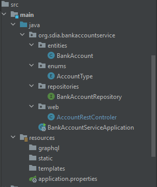

First, creat spring project with Spring Data JPA, Spring web, H2 Database, Lombok, Spring for GraphQL, Swagger dependencies

<ol type="1">
    <h3><li>JPA Bank Account</li></h3>
    <pre>@Entity
        @Data
        @NoArgsConstructor @AllArgsConstructor @Builder
        public class BankAccount {
            @Id
            private String id;
            private Date createdAt;
            private Double balance;
            private String currency;
            @Enumerated(EnumType.STRING)
            private AccountType type;
        }
    </pre>
    <h3><li>BankAccountRepository Interface</li></h3>
    <pre>
        public interface BankAccountRepository extends JpaRepository<'BankAccount,String> {
        }
    </pre>
    <h3><li>BankAccountServiceApplication</li></h3>
    <pre>
        @SpringBootApplication
        public class BankAccountServiceApplication {
            public static void main(String[] args) {
                SpringApplication.run(BankAccountServiceApplication.class, args);
            }
            @Bean
            CommandLineRunner start(BankAccountRepository bankAccountRepository){
                return args->{
                    for(int i=0;i<10;i++){
                        BankAccount bankAccount =BankAccount.builder()
                                .id(UUID.randomUUID().toString())
                                .type(Math.random()>0.5? AccountType.CURRENT_ACCOUNT:AccountType.SAVING_ACCOUNT)
                                .balance(10000+Math.random()*9000)
                                .createdAt(new Date())
                                .currency("MAD")
                                .build();
                        bankAccountRepository.save(bankAccount);
                    }
                };
            }
        }
    </pre>
    <h3><li>Test</li></h3>
    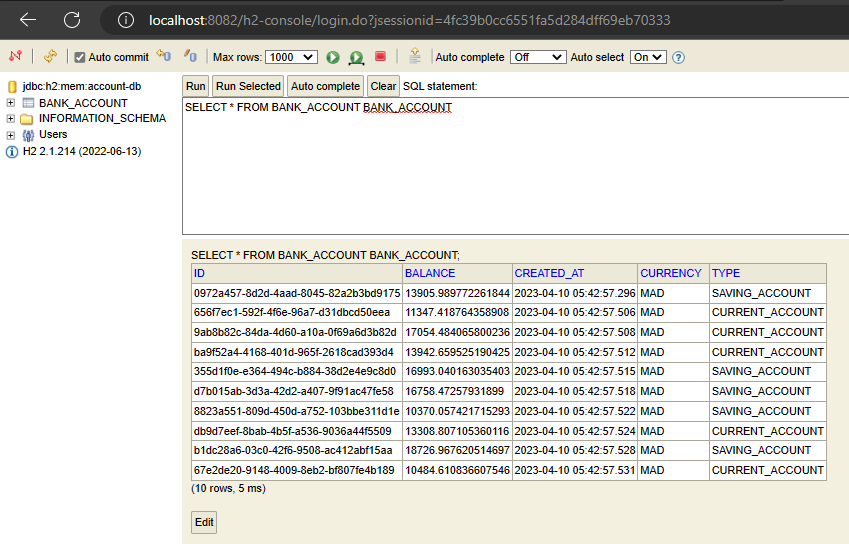
    <h3><li>Restful web service(AccountRestController)</li></h3>
    <pre>
        @RestController
        public class AccountRestControler {
            private BankAccountRepository bankAccountRepository;
            public AccountRestControler(BankAccountRepository bankAccountRepository){
                this.bankAccountRepository=bankAccountRepository;
            }
            @GetMapping("/bankAccounts")
            public List<'BankAccount> bankAccounts(){
                return bankAccountRepository.findAll();
            }
            @GetMapping("/bankAccounts/{id}")
            public BankAccount bankAccount(@PathVariable String id){
                return bankAccountRepository.findById(id)
                        .orElseThrow(()->new RuntimeException(String.format("Account %s not found",id)));
            }
            @PostMapping("/bankAccounts")
            public BankAccount save(@RequestBody BankAccount bankAccount){
                if(bankAccount.getId()==null) bankAccount.setId(UUID.randomUUID().toString());
                return bankAccountRepository.save(bankAccount);
            }
            @PutMapping("/bankAccounts/{id}")
            public BankAccount update(@PathVariable String id,@RequestBody BankAccount bankAccount){
                BankAccount account=bankAccountRepository.findById(id).orElseThrow();
                if(bankAccount.getBalance()!=null)account.setBalance(bankAccount.getBalance());
                if(bankAccount.getCreatedAt()!=null)account.setCreatedAt(bankAccount.getCreatedAt());
                if(bankAccount.getType()!=null)account.setType(bankAccount.getType());
                if(bankAccount.getCurrency()!=null)account.setCurrency(bankAccount.getCurrency());
                return bankAccountRepository.save(account);
            }
            @DeleteMapping("/bankAccounts")
            public void delete(@PathVariable String id){
                bankAccountRepository.deleteById(id);
            }
        }
    </pre>
    <h3><li>Test the web micro-service using Browser</li></h3>
    
Show all Bank accounts

    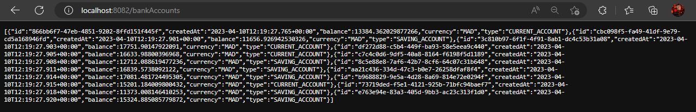
    
Show Bank account by ID

    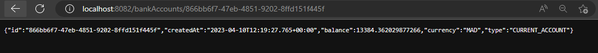
    <h3><li>Test the web micro-service using a Postman client</li></h3>
    <ul type="circle">
        <h4><li>Get all bank accounts</li></h4>
            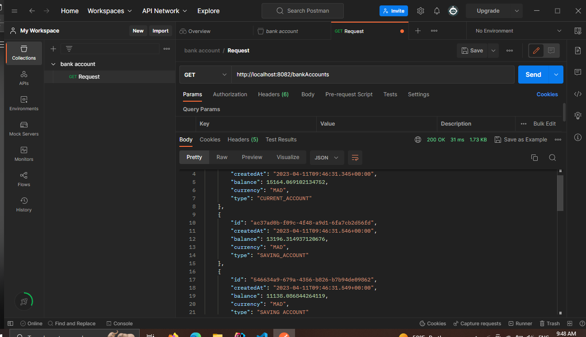
        <pre> @GetMapping("/bankAccounts")
        public List<'BankAccount> bankAccounts(){
            return bankAccountRepository.findAll();
        }</pre>
        <h4><li>Get bank account by ID</li></h4>
            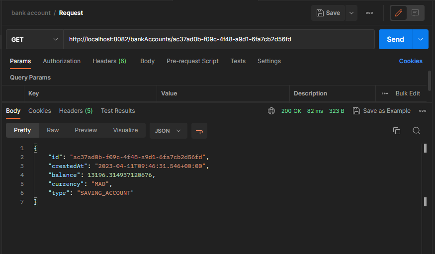
        <pre>@GetMapping("/bankAccounts/{id}")
        public BankAccount bankAccount(@PathVariable String id){
            return bankAccountRepository.findById(id)
                    .orElseThrow(()->new RuntimeException(String.format("Account %s not found",id)));
        }</pre>
        <h4><li>Save bank account</li></h4>
            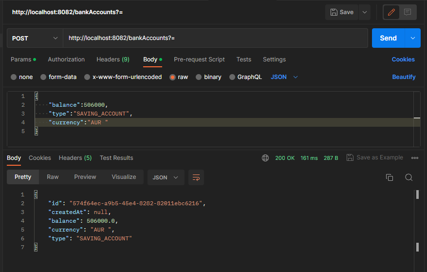
        <pre>@PostMapping("/bankAccounts")
        public BankAccount save(@RequestBody BankAccount bankAccount){
            if(bankAccount.getId()==null) bankAccount.setId(UUID.randomUUID().toString());
            return bankAccountRepository.save(bankAccount);
        }</pre>
        <h4><li>Update account</li></h4>
            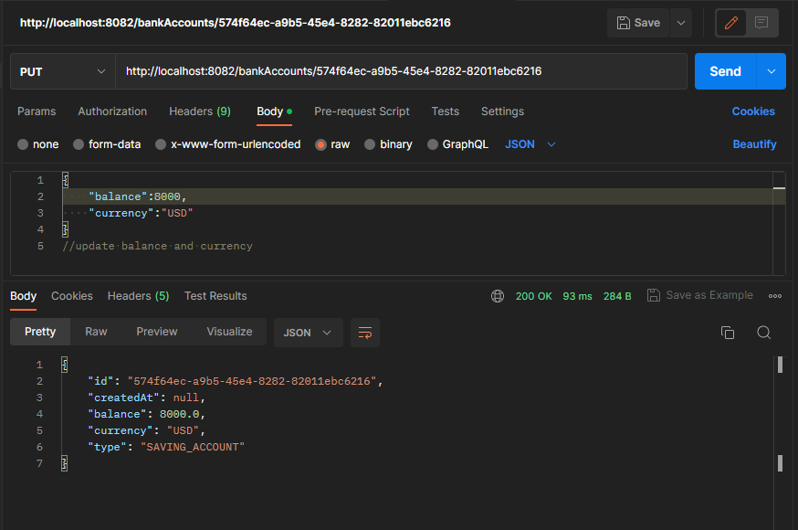
        <pre>@PutMapping("/bankAccounts/{id}")
        public BankAccount update(@PathVariable String id,@RequestBody BankAccount bankAccount){
            BankAccount account=bankAccountRepository.findById(id).orElseThrow();
            if(bankAccount.getBalance()!=null)account.setBalance(bankAccount.getBalance());
            if(bankAccount.getCreatedAt()!=null)account.setCreatedAt(bankAccount.getCreatedAt());
            if(bankAccount.getType()!=null)account.setType(bankAccount.getType());
            if(bankAccount.getCurrency()!=null)account.setCurrency(bankAccount.getCurrency());
            return bankAccountRepository.save(account);
        }</pre>
        <h4><li>Delete bank account by ID</li></h4>
        
Before

        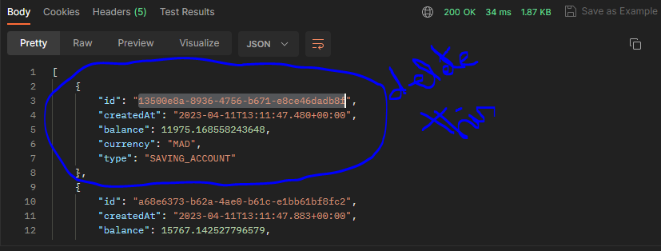
        
Delete

        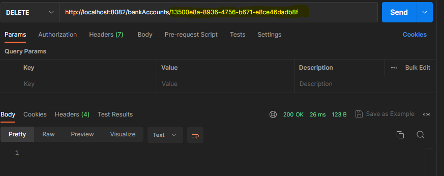
        
After

        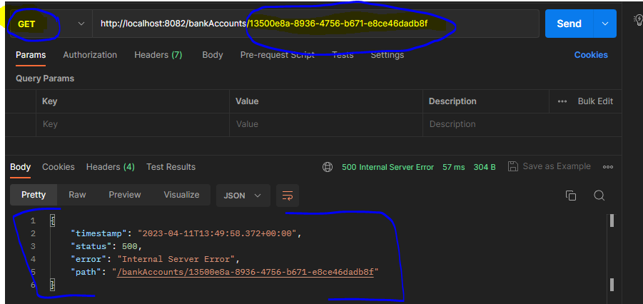
        <pre>@DeleteMapping("/bankAccounts")
        public void delete(@PathVariable String id){
            bankAccountRepository.deleteById(id);
        }</pre>
    </ul>
<h3><li>Swagger</li></h3>
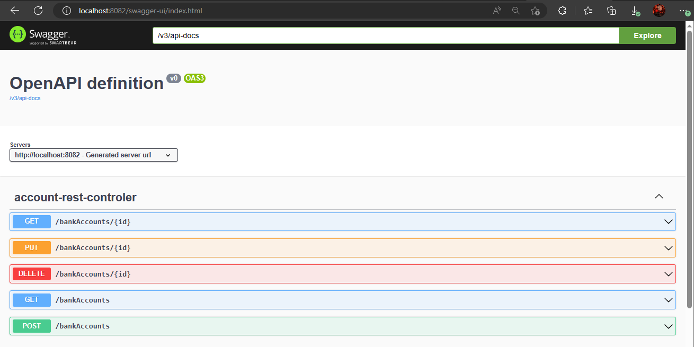

Add bank account using post method 

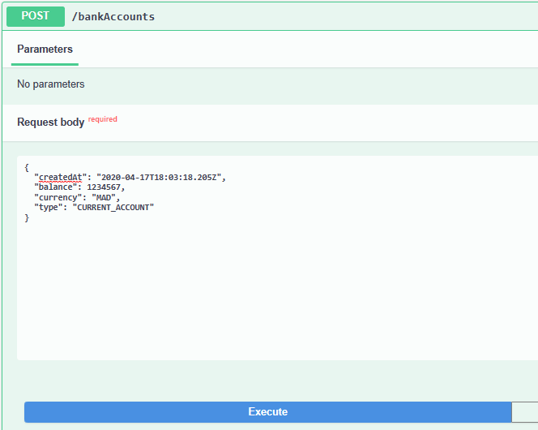

Get the bank account that already added

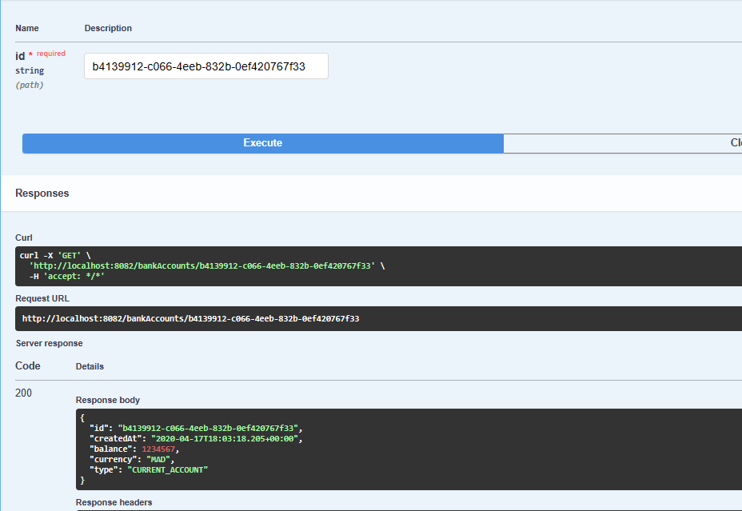

We can try other methods in the same way 

<h3><li>Spring Data Rest</li></h3>

Add Spring data rest dependency, to create a generic web service

Add bank account using post method 

</ol>