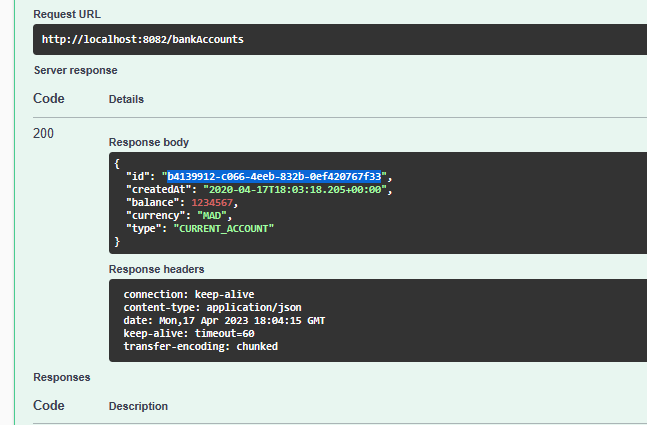

<h1>Architectures Micro-services   Spring Cloud </h1>
<h3>Manage bank accounts using Micro service.</h3>

  Asmae EL HYANI  Distributed System & Artificial Intelligence Master’s  ENSET Mohammedia

   
<h2>Introduction</h2>

a Spring Boot project with web dependencies, Spring Data JPA, H2, Lombok

First, creat spring project with Spring Data JPA, Spring web, H2 Database, Lombok, Spring for GraphQL, Swagger dependencies

<ol type="I">
    <h2><li>Restful </li></h2>
</ol>
<ol type="1">
    <h3><li>JPA Bank Account</li></h3>
    <pre>@Entity
        @Data
        @NoArgsConstructor @AllArgsConstructor @Builder
        public class BankAccount {
            @Id
            private String id;
            private Date createdAt;
            private Double balance;
            private String currency;
            @Enumerated(EnumType.STRING)
            private AccountType type;
        }
    </pre>
    <h3><li>BankAccountRepository Interface</li></h3>
    <pre>
        public interface BankAccountRepository extends JpaRepository<'BankAccount,String> {
        }
    </pre>
    <h3><li>BankAccountServiceApplication</li></h3>
    <pre>
        @SpringBootApplication
        public class BankAccountServiceApplication {
            public static void main(String[] args) {
                SpringApplication.run(BankAccountServiceApplication.class, args);
            }
            @Bean
            CommandLineRunner start(BankAccountRepository bankAccountRepository){
                return args->{
                    for(int i=0;i<10;i++){
                        BankAccount bankAccount =BankAccount.builder()
                                .id(UUID.randomUUID().toString())
                                .type(Math.random()>0.5? AccountType.CURRENT_ACCOUNT:AccountType.SAVING_ACCOUNT)
                                .balance(10000+Math.random()*9000)
                                .createdAt(new Date())
                                .currency("MAD")
                                .build();
                        bankAccountRepository.save(bankAccount);
                    }
                };
            }
        }
    </pre>
    <h3><li>Test</li></h3>
    
    <h3><li>Restful web service(AccountRestController)</li></h3>
    <pre>
        @RestController
        public class AccountRestControler {
            private BankAccountRepository bankAccountRepository;
            public AccountRestControler(BankAccountRepository bankAccountRepository){
                this.bankAccountRepository=bankAccountRepository;
            }
            @GetMapping("/bankAccounts")
            public List<'BankAccount> bankAccounts(){
                return bankAccountRepository.findAll();
            }
            @GetMapping("/bankAccounts/{id}")
            public BankAccount bankAccount(@PathVariable String id){
                return bankAccountRepository.findById(id)
                        .orElseThrow(()->new RuntimeException(String.format("Account %s not found",id)));
            }
            @PostMapping("/bankAccounts")
            public BankAccount save(@RequestBody BankAccount bankAccount){
                if(bankAccount.getId()==null) bankAccount.setId(UUID.randomUUID().toString());
                return bankAccountRepository.save(bankAccount);
            }
            @PutMapping("/bankAccounts/{id}")
            public BankAccount update(@PathVariable String id,@RequestBody BankAccount bankAccount){
                BankAccount account=bankAccountRepository.findById(id).orElseThrow();
                if(bankAccount.getBalance()!=null)account.setBalance(bankAccount.getBalance());
                if(bankAccount.getCreatedAt()!=null)account.setCreatedAt(bankAccount.getCreatedAt());
                if(bankAccount.getType()!=null)account.setType(bankAccount.getType());
                if(bankAccount.getCurrency()!=null)account.setCurrency(bankAccount.getCurrency());
                return bankAccountRepository.save(account);
            }
            @DeleteMapping("/bankAccounts")
            public void delete(@PathVariable String id){
                bankAccountRepository.deleteById(id);
            }
        }
    </pre>
    <h3><li>Test the web micro-service using Browser</li></h3>
    
Show all Bank accounts

    
    
Show Bank account by ID

    
    <h3><li>Test the web micro-service using a Postman client</li></h3>
    <ul type="circle">
        <h4><li>Get all bank accounts</li></h4>
            
        <pre> @GetMapping("/bankAccounts")
        public List<'BankAccount> bankAccounts(){
            return bankAccountRepository.findAll();
        }</pre>
        <h4><li>Get bank account by ID</li></h4>
            
        <pre>@GetMapping("/bankAccounts/{id}")
        public BankAccount bankAccount(@PathVariable String id){
            return bankAccountRepository.findById(id)
                    .orElseThrow(()->new RuntimeException(String.format("Account %s not found",id)));
        }</pre>
        <h4><li>Save bank account</li></h4>
            
        <pre>@PostMapping("/bankAccounts")
        public BankAccount save(@RequestBody BankAccount bankAccount){
            if(bankAccount.getId()==null) bankAccount.setId(UUID.randomUUID().toString());
            return bankAccountRepository.save(bankAccount);
        }</pre>
        <h4><li>Update account</li></h4>
            
        <pre>@PutMapping("/bankAccounts/{id}")
        public BankAccount update(@PathVariable String id,@RequestBody BankAccount bankAccount){
            BankAccount account=bankAccountRepository.findById(id).orElseThrow();
            if(bankAccount.getBalance()!=null)account.setBalance(bankAccount.getBalance());
            if(bankAccount.getCreatedAt()!=null)account.setCreatedAt(bankAccount.getCreatedAt());
            if(bankAccount.getType()!=null)account.setType(bankAccount.getType());
            if(bankAccount.getCurrency()!=null)account.setCurrency(bankAccount.getCurrency());
            return bankAccountRepository.save(account);
        }</pre>
        <h4><li>Delete bank account by ID</li></h4>
        
Before

        
        
Delete

        
        
After

        
        <pre>@DeleteMapping("/bankAccounts")
        public void delete(@PathVariable String id){
            bankAccountRepository.deleteById(id);
        }</pre>
    </ul>
<h3><li>Swagger</li></h3>

Add bank account using post method 

Get the bank account that already added

We can try other methods in the same way 

<h3><li>Spring Data Rest</li></h3>

Add Spring data rest dependency, to create a generic web service

-Dependency

<pre>
<.dependency>
    <groupId>org.springframework.boot</groupId>
    <artifactId>spring-boot-starter-data-rest</artifactId>
<./dependency>
</pre>

-Add "@RequestMapping("/api")" to the AccountRestControler.java 

-BankAccountRepository 1

<pre>
@RepositoryRestResource  
public interface BankAccountRepository extends JpaRepository<.BankAccount,String> {
List<.BankAccount> findByType(AccountType type);
}
</pre>

Test methode repository findByType, It gives us the opportunity to search the bank account by type

-BankAccountRepository 2

<pre>
@RepositoryRestResource  
public interface BankAccountRepository extends JpaRepository<.BankAccount,String> {
    @RestResource(path="/byType")
    List<.BankAccount> findByType(@Param("t") AccountType type);
}
</pre>

-Projection

<pre>
@Projection(types = BankAccount.class,name = "p1")
public interface AccountProjection {
    public String getId();
    public AccountType getType();
}
</pre>

<h3><li>Add DTOs and Mappers</li></h3>
<h3><li>Service layer</li></h3>

-AccountService Interface

<pre>
public interface AccountService  {
     BankAccountResponseDTO addAccount(BankAccountRequestDTO bankAccountDTO);
}</pre>

-AccountServiceImp : AccountService Interface implementation

<pre>
@Service  @Transactional
public class AccountServiceImpl implements AccountService {
    @Autowired
    private BankAccountRepository  bankAccountRepository;
    @Autowired
    private AccountMapper accountMapper;
    @Override
    public BankAccountResponseDTO addAccount(BankAccountRequestDTO bankAccountDTO) {
        BankAccount bankAccount=accountMapper.newBankAccount(bankAccountDTO);
        BankAccount saveBankAccount=bankAccountRepository.save(bankAccount);
        BankAccountResponseDTO bankAccountResponseDTO=accountMapper.fromBankAccount(saveBankAccount);
        return bankAccountResponseDTO;
    }
}
</pre>
<h3><li>DTO</li></h3>

-BankAccountRequestDTO

<pre>
@Data
@NoArgsConstructor @AllArgsConstructor @Builder
public class BankAccountRequestDTO {
    private Double balance;
    private String currency;
    @Enumerated(EnumType.STRING)
    private AccountType type;
}
</pre>

-BankAccountResponseDTO

<pre>@Data @NoArgsConstructor @AllArgsConstructor @Builder
public class BankAccountResponseDTO {
    private String id;
    private Date createdAt;
    private Double balance;
    private String currency;
    private AccountType type;
}</pre>
<h3><li>Mappers</li></h3>

-AccountMapper

<pre>
@Component
public class AccountMapper {
    public BankAccount newBankAccount(BankAccountRequestDTO bankAccountDTO){
        BankAccount bankAccount=new BankAccount();
        BeanUtils.copyProperties(bankAccountDTO,bankAccount);
        bankAccount.setId(UUID.randomUUID().toString());
        bankAccount.setCreatedAt(new Date());
        return bankAccount;
    }
    public BankAccountResponseDTO fromBankAccount(BankAccount bankAccount){
        BankAccountResponseDTO bankAccountResponseDTO=new BankAccountResponseDTO();
        BeanUtils.copyProperties(bankAccount,bankAccountResponseDTO);
        return bankAccountResponseDTO;
    }
}
</pre>

</ol>
<ol type="I" start="2">
    <h2><li>GraphGL</li></h2>
</ol>
<ol type="1">
    <h3><li>Schema</li></h3>
<pre>
type Query {
    accountsList : [BankAccount],
    accountById(id:String) : BankAccount
}

type Mutation{
addAccount(bankAccount : BankAccountDTO) : BankAccount,
updateAccount(id : String,bankAccount : BankAccountDTO):BankAccount,
deleteAccount(id : String) : Boolean
}

type BankAccount{
id : String,
createdAt : Float,
balance : Float,
currency : String,
type : String
}

input BankAccountDTO {
balance : Float,
currency : String,
type : String
}
</pre>
<h3><li>Account service</li></h3>
<pre>
@Service  @Transactional
public class AccountServiceImpl implements AccountService {
    @Autowired
    private BankAccountRepository  bankAccountRepository;
    @Autowired
    private AccountMapper accountMapper;
    @Override
    public BankAccountResponseDTO addAccount(BankAccountRequestDTO bankAccountDTO) {
        BankAccount bankAccount=accountMapper.newBankAccount(bankAccountDTO);
        BankAccount saveBankAccount=bankAccountRepository.save(bankAccount);
        BankAccountResponseDTO bankAccountResponseDTO=accountMapper.fromBankAccount(saveBankAccount);
        return bankAccountResponseDTO;
    }
    @Override
    public BankAccountResponseDTO update(String id, BankAccountRequestDTO bankAccountDTO) {
        BankAccount bankAccount=accountMapper.newBankAccount(bankAccountDTO);
        bankAccount.setId(id);
        BankAccount saveBankAccount=bankAccountRepository.save(bankAccount);
        BankAccountResponseDTO bankAccountResponseDTO=accountMapper.fromBankAccount(saveBankAccount);
        return bankAccountResponseDTO;
    }

}
</pre>
<h3><li>Bank Account GraphQL Controller</li></h3>
<pre>
@Controller
public class BankAccountGraphQlController {
    @Autowired
    private AccountService accountService;
    @Autowired
    private BankAccountRepository bankAccountRepository;
    @QueryMapping
    public List<.BankAccount> accountsList(){
        return bankAccountRepository.findAll();
    }
    @QueryMapping
    public BankAccount accountById(@Argument String id){
        return bankAccountRepository.findById(id)
                .orElseThrow(()->new RuntimeException(String.format("Account %s not found ",id)));
    }
    @MutationMapping
    public BankAccountResponseDTO addAccount(@Argument BankAccountRequestDTO bankAccount){
        return accountService.addAccount(bankAccount);
    }
    @MutationMapping
    public BankAccountResponseDTO updateAccount(@Argument String id,@Argument BankAccountRequestDTO bankAccount){
        return accountService.update(id,bankAccount);
    }
    @MutationMapping
    public boolean deleteAccount(@Argument String id){
        bankAccountRepository.deleteById(id);
        return true;
    }
}
</pre>
<h3><li>Test</li></h3>
<h5>Add account</h5>

We can use two methods

<h5>Get account by ID</h5>

<h5>Update account</h5>

<h5>Delete account</h5>

Verification

<h3><li>With Customer class</li></h3>

customer class

<pre>
@Entity
@Builder
@NoArgsConstructor @AllArgsConstructor @Data
public class Customer {
    @Id @GeneratedValue(strategy = GenerationType.IDENTITY)
    private Long id;
    private String name;
    @OneToMany(mappedBy = "customer")
    @JsonProperty(access = JsonProperty.Access.WRITE_ONLY)
    private List<.BankAccount> bankAccounts;
}
</pre>

graphql schema

<pre>
type Query {
    accountsList : [BankAccount],
    accountById(id:String) : BankAccount,
    customers:[Customer]
}

type Mutation{
addAccount(bankAccount : BankAccountDTO) : BankAccount,
updateAccount(id : String,bankAccount : BankAccountDTO):BankAccount,
deleteAccount(id : String) : Boolean
}
type Customer{
id:ID,
name:String,
bankAccounts:[BankAccount]
}

type BankAccount{
id : String,
createdAt : Float,
balance : Float,
currency : String,
type : String,
customer:Customer
}
input BankAccountDTO {
balance : Float,
currency : String,
type : String
}
</pre>

Application class

<pre>
@SpringBootApplication

public class BankAccountServiceApplication {
	public static void main(String[] args) {
		SpringApplication.run(BankAccountServiceApplication.class, args);
	}
	@Bean
	CommandLineRunner start(BankAccountRepository bankAccountRepository, CustomerRepository customerRepository){
		return args->{
			Stream.of("Yassin","Hakima","Anwar","Imane").forEach(c->{
					Customer customer=Customer.builder()
							.name(c)
							.build();
					customerRepository.save(customer);
			});
			customerRepository.findAll().forEach(customer ->{
				for(int i=0;i<10;i++){
					BankAccount bankAccount =BankAccount.builder()
							.id(UUID.randomUUID().toString())
							.type(Math.random()>0.5? AccountType.CURRENT_ACCOUNT:AccountType.SAVING_ACCOUNT)
							.balance(10000+Math.random()*9000)
							.createdAt(new Date())
							.currency("MAD")
							.customer(customer)
							.build();
					bankAccountRepository.save(bankAccount);
				}
			});
		};
	}
}
</pre>

Customer repository

<pre>
@RepositoryRestResource
public interface CustomerRepository extends JpaRepository<.Customer,Long> {
}
</pre>

Graphql Controller

<pre>
@Controller
public class BankAccountGraphQlController {
    @Autowired
    private AccountService accountService;
    @Autowired
    private CustomerRepository customerRepository;
    @Autowired
    private BankAccountRepository bankAccountRepository;
    @QueryMapping
    public List<.BankAccount> accountsList(){
        return bankAccountRepository.findAll();
    }
    @QueryMapping
    public BankAccount accountById(@Argument String id){
        return bankAccountRepository.findById(id)
                .orElseThrow(()->new RuntimeException(String.format("Account %s not found ",id)));
    }
    @MutationMapping
    public BankAccountResponseDTO addAccount(@Argument BankAccountRequestDTO bankAccount){
        return accountService.addAccount(bankAccount);
    }
    @MutationMapping
    public BankAccountResponseDTO updateAccount(@Argument String id,@Argument BankAccountRequestDTO bankAccount){
        return accountService.update(id,bankAccount);
    }
    @MutationMapping
    public boolean deleteAccount(@Argument String id){
        bankAccountRepository.deleteById(id);
        return true;
    }
    @QueryMapping
    public List<.Customer> customers(){
        return customerRepository.findAll();
    }
}
</pre>

<h3><li>Test</li></h3>
<h5>Get the Customers of bank account</h5>

</ol>